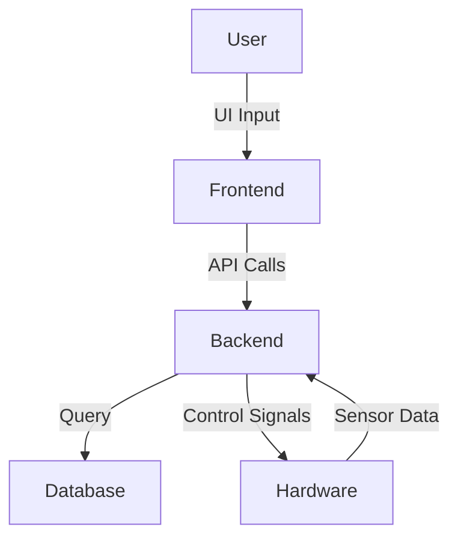

# 🚀 Project Title: IOT BASED SMART CRADLE SYSTEM

## 📌 Overview
Provide an IoT-based Smart Cradle System integrated with computer vision (CV) to monitor the infant and alert the parents in case of anomalies.

## 🧠 Key Features
- ✅ Real-time tracking / face recognition / smart control
- ✅ IoT Support]
- ✅ Data Analytics]
- ✅ AI/ML integration

## 🛠️ Technologies Used

### 💻 Frontend


### 🧩 Backend


### ⚙️ Hardware (if applicable)


## 🧩 Available Platforms
- 🌐 Web
- 🚀 Embedded

## ⚙️ System Architecture


## 📸 Screenshots / Demo

| Dashboard |
|-----------|
|  
|


## 📱 Installation & Setup

### Prerequisites
- [ ] Node.js
- [ ] ESP32 drivers
- [ ] Visual Studio Code

### Setup Steps
```bash
# Clone the repository
git clone https://github.com/your-username/your-project-name.git
cd your-project-name

# Install dependencies
npm install         # For Node.js backend

# Start the development server
npm run dev         # or node server.js

```

## 📄 License
This project is licensed under the [MIT License](LICENSE).
